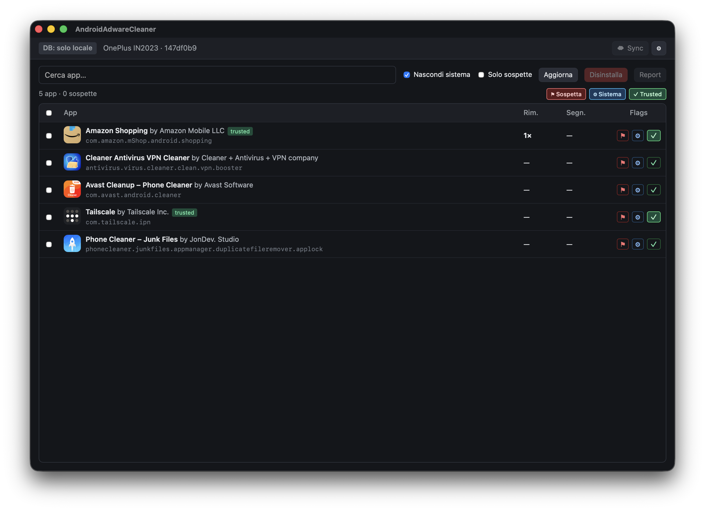
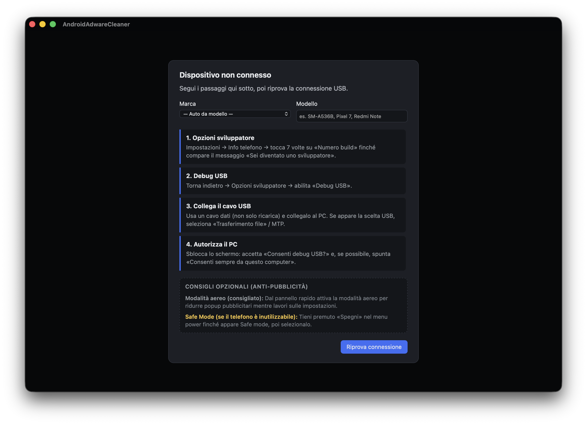
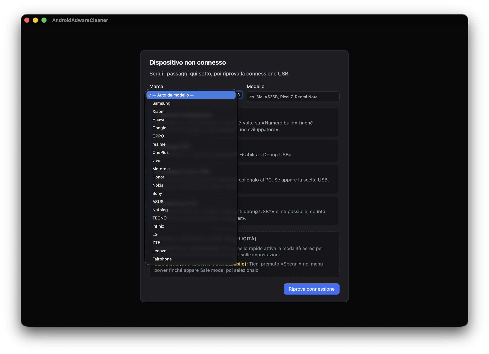
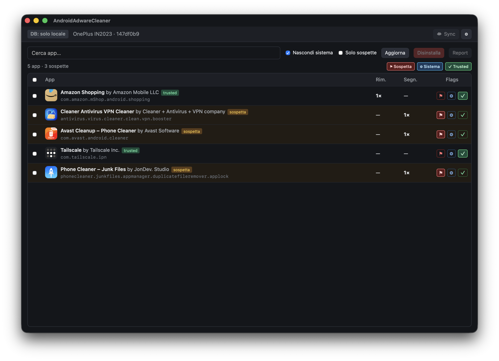
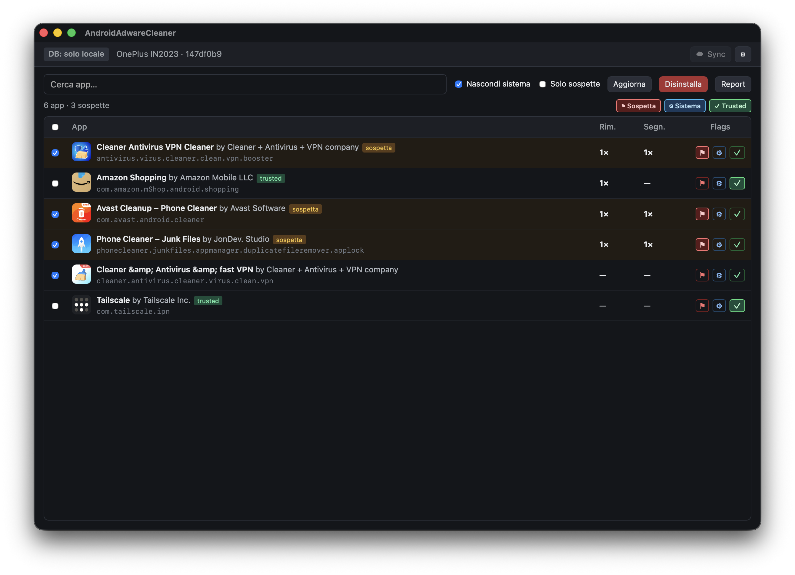
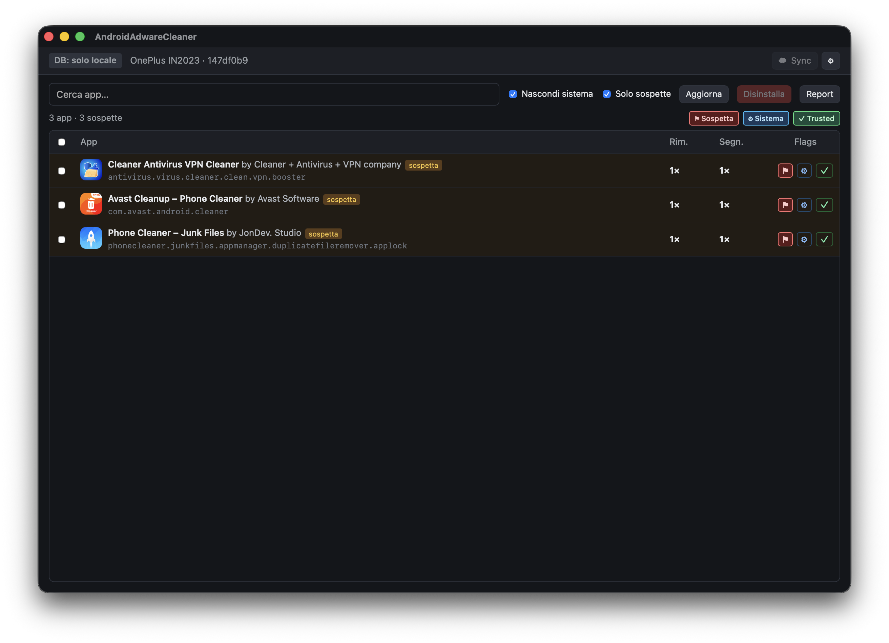

# AndroidAdwareCleaner

**Pulizia adware e app sospette su Android — pensato per negozi di riparazione.**

App desktop per **macOS** e **Windows** che collega il telefono via USB (ADB), elenca le app installate, evidenzia quelle sospette grazie a un database condiviso, e permette di disinstallarle in blocco con report per il cliente.

<p align="center">
  
</p>

---

## Perché usarlo

- **Veloce in banco:** niente menu Android a mano — vedi subito cleaner, VPN truffaldine e adware.
- **Memoria di negozio:** ogni disinstallazione e segnalazione alimenta un database locale (e opzionalmente cloud) con conteggio *«rimossa X volte»* / *«segnalata X volte»*.
- **Sicuro:** blocklist per app di sistema; conferma prima della disinstallazione; niente bypass di FRP o autorizzazione ADB.
- **Multi-PC:** sincronizza il database su Google Drive / OneDrive (cartella condivisa tra i PC del negozio).

---

## Come funziona

### 1. Collega il telefono

All’avvio l’app verifica ADB e guida alla connessione USB: opzioni sviluppatore, debug USB, autorizzazione PC. Supporta le principali marche con istruzioni Safe Mode per modello.

<p align="center">
  
</p>

<p align="center">
  
</p>

### 2. Scansiona e filtra

Lista app con **icona**, nome, autore e package. Filtri per nascondere il sistema, cercare per nome e mostrare solo le sospette.

### 3. Segnala con le flag

Ogni riga ha tre flag:

| Flag | Significato |
|------|-------------|
| 🚩 **Sospetta** | Segnala adware / app indesiderata nel database |
| ⚙️ **Sistema** | Escludi dall’elenco (app di sistema) |
| ✅ **Trusted** | App sicura — non compare tra le sospette |

<p align="center">
  
</p>

Le colonne **Rim.** e **Segn.** mostrano quante volte l’app è stata rimossa o segnalata nel database (tuo negozio + sync cloud).

### 4. Disinstalla in blocco

Seleziona più app → **Disinstalla**. Il database si aggiorna e, se configurato, viene sincronizzato sul cloud.

<p align="center">
  
</p>

<p align="center">
  
</p>

### 5. Sync e aggiornamenti

- **☁ Sync** — allinea il database tra più PC (pull all’avvio, push dopo disinstallazione).
- **Aggiornamenti automatici** — all’avvio controlla GitHub Releases e propone l’installazione della nuova versione.

---

## Requisiti

| Componente | Dettaglio |
|------------|-----------|
| **PC** | macOS (Apple Silicon o Intel) o Windows 10/11 |
| **Telefono** | Android con **Debug USB** attivo e PC autorizzato |
| **Cavo** | USB dati (non solo ricarica) |
| **ADB** | Installato dall’app al primo avvio, oppure già presente sul sistema |

---

## Download

> Le build ufficiali saranno pubblicate nelle [GitHub Releases](https://github.com/sebastianoboem/AndroidAdwareCleaner/releases).

| Piattaforma | File |
|-------------|------|
| macOS (Apple Silicon) | `AndroidAdwareCleaner_*_aarch64.dmg` |
| macOS (Intel) | `AndroidAdwareCleaner_*_x64.dmg` |
| Windows | `AndroidAdwareCleaner_*_x64-setup.exe` |

---

## Sviluppo

```bash
npm install
bash scripts/download-platform-tools.sh   # opzionale: adb locale
npm run tauri dev
```

Build release:

```bash
npm run tauri build
```

Versioning e pubblicazione release: [docs/RELEASE.md](docs/RELEASE.md).

---

## Struttura dati

- **Database locale:** `~/Library/Application Support/AndroidAdwareCleaner/` (macOS) o equivalente Windows.
- **Sync cloud:** file `reputation-sync.json` in cartella Drive/OneDrive configurata nelle impostazioni.

---

## Note legali

Utilizzare solo con **consenso del cliente**. Lo strumento non aggira protezioni del dispositivo (FRP, blocco schermo, ecc.).

---

## Licenza

Progetto proprietario — © Sebastiano Boem. Tutti i diritti riservati.
